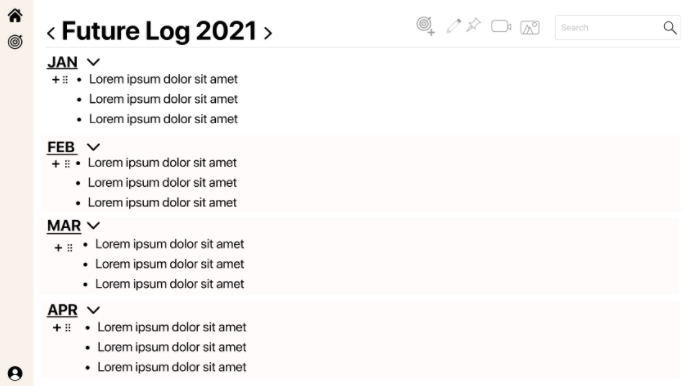
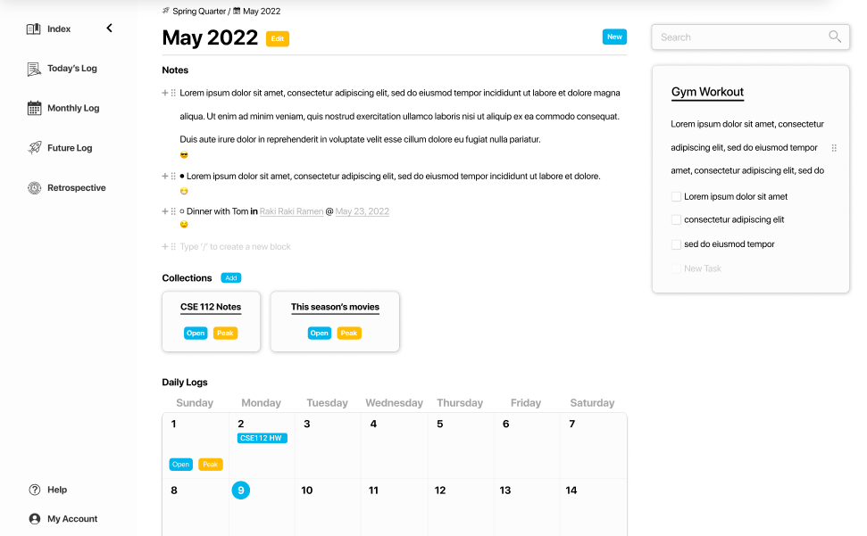

# UI Changes

Created: June 5, 2022 6:57 PM
Last Edited Time: June 5, 2022 8:12 PM
Status: In Review

# Context

Looking at the original design of the UI, we wanted to add more accessibility and color, along with a more intuitive navigation system. To fix this, we made various Figma designs on how we wanted it to look and considered separating the page into a log component, header, and side bar to track goals and logs more easily. However, we did want to keep the currently functioning text boxes that we inherited. 

# Decision Summary

The original design of the UI utilized a lot of text and drop downs to navigate between different levels of logs. It also had a less intuitive pictographic navigation bar and a bunch of buttons that did not work. To fix this, we condensed and standardized the UI into Log Components, added a side bar to track goals, and revamped both the header and navigation bar to be more user friendly and contain fewer broken features. We also decided to add a calendar in monthly log views to more readily access daily logs. 

# UI Changes Pros and Cons

## Pros

- More intuitive navigation and access
- Updated visuals and more color over pure text
- Fewer random broken buttons/features
- Better views of logs for users to manage their work
- Still utilizes the already working text boxes that plan events, notes, and todo lists

## Cons

- Search bar is currently not working
- Very big revamp of the UI that will require lots of testing to ensure no bugs
- A lot of code to update visuals and routing without changing too much actual functionality

# Conclusion

We now have individual logs with their own specific notes and content displayed, rather than only having content in daily logs. As noted, we create a Card component as a design feature to display goals and other logs in a more user friendly manner, making the app less text heavy.

Before: 

After: 

# Consequences

There are a lot of bugs and integration of the new features and UI changes into the old database, which just need to be tested and ironed out. There is also increased complexity, but at the trade off of more intuitive page navigation.